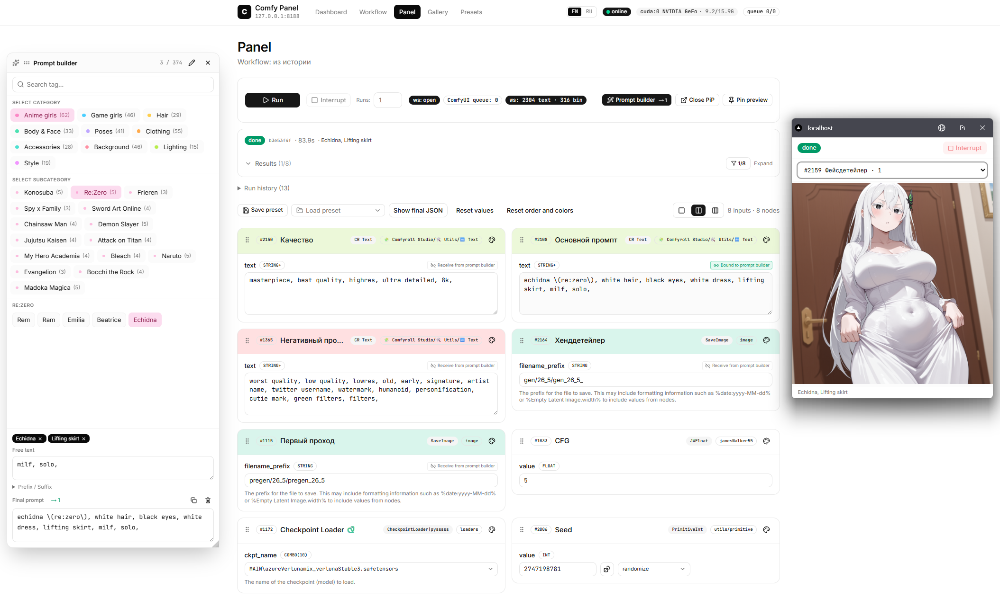

# Comfy Panel

A web control panel for [ComfyUI](https://github.com/comfyanonymous/ComfyUI). Import any API-format workflow, expose just the inputs you actually tweak (prompt, seed, steps, CFG, sampler, LoRA, etc.) and run them through a clean form with live progress, a Picture-in-Picture preview window, gallery and presets.

> 🇷🇺 Русская версия — [README.ru.md](README.ru.md)



## Features

- **Dashboard** — live ComfyUI status, GPU/VRAM, queue, search across all installed nodes.
- **Workflow import** — drag&drop, file picker, paste, or one-click import from ComfyUI history / queue. Strict API-format validation.
- **Dynamic panel** — automatically generates the right widget per input type (`INT`, `FLOAT`, `STRING`, `BOOLEAN`, `COMBO`) using ComfyUI's `/object_info` schema. Sliders for ranged numbers, multiline textareas for prompts, searchable selects for hundreds of LoRAs/checkpoints, dedicated seed widget with `fixed / randomize / increment / decrement`.
- **Drag & drop reordering** of node cards, **per-block colors** (11 palettes) and a 1 / 2 / 3 column view switcher.
- **Live runner** — submits to `/prompt`, streams progress via WebSocket, shows current node, progress bar, errors, and **live preview** images during sampling. Interrupt button. Run history.
- **Picture-in-Picture** preview window (Chrome/Edge 116+) and a pinnable floating preview that stays on top while you scroll.
- **Gallery** — paginated history of all runs with previews, metadata tabs (Images / Workflow / Status), one-click "use as workflow" import.
- **Presets** — save the full setup (workflow + exposed inputs + values + seed modes + layout + colors + prompt-builder bindings) as a JSON file in `data/presets/`. Load, rename, delete from a dedicated page.
- **Prompt builder** — floating, draggable, resizable window with a two-level tag library (Categories → Subcategories → Tags) and ~370 starter tags across 10 categories. Every tag is `{ label, value, labelRu? }` so a short Russian/English name like `Aqua` can stand for a long Booru-style string, while final prompts always go to the model in English. Click tags to build the prompt, write **free text** for fine-tuning that doesn't fit a tag, set **prefix / suffix**, search across the whole library, and **bind any STRING input on the panel** to the builder via a checkbox — bound inputs auto-update.
- **Iterate / Random** modes per category or subcategory — click the dot indicator on any chip to cycle `off → ↻ iterate → 🎲 random`. With Iterate the next tag from the group is auto-injected on every Run; with Random a random one. Works inside batch runs too — perfect for cycling characters, poses, outfits.
- **Batch runs** — number-of-runs field next to Run; queues N consecutive prompts with seed-control and iterate/random applied between each.
- **Lightbox** — full-screen viewer for output images with prev/next/keyboard navigation, thumbnails, download.
- **Output source filters** — when the workflow has multiple output nodes (SaveImage + PreviewImage etc.), pick which to show. The main panel uses **multi-select checkboxes** (show any combination); the live-preview window (PiP / pinned) uses an independent **single-source selector**.
- **Persistent runs** — your current and recent runs (with their final images) survive a page reload.
- **Run names from prompt builder** — the builder tags active when you queued a prompt are stored on the run itself and displayed in the run cards, the live preview, and the Gallery (`null` if none).
- **Per-run interrupt** — every queued/running card has its own ◻ button: stops just that prompt (drops it from the queue, or interrupts only the active one). The main toolbar's **Interrupt** clears the entire pending queue when batch-running.
- **Bilingual UI** — English / Русский, switchable in the header.

## Screenshots

| Screen      | Path                                |
| ----------- | ----------------------------------- |
| Dashboard   | `docs/screenshots/dashboard.png`    |
| Workflow    | `docs/screenshots/workflow.png`     |
| Panel       | `docs/screenshots/panel.png`        |
| Live preview| `docs/screenshots/preview.png`      |
| Gallery     | `docs/screenshots/gallery.png`      |
| Presets     | `docs/screenshots/presets.png`      |

> Drop your own screenshots into `docs/screenshots/` with the file names above and they will appear in this README automatically.

## Requirements

- **Node.js 20+** (LTS recommended) — [download](https://nodejs.org/).
- **A running ComfyUI** instance. By default the panel expects it at `http://127.0.0.1:8188`. Tested with **ComfyUI 0.19+** (frontend ≥ 1.42).
- **Modern browser** — Chrome / Edge / Firefox. PiP requires Chromium-based 116+.

## Quick start (Windows)

1. Install [Node.js 20+](https://nodejs.org/) and start ComfyUI (any way you usually do).
2. Clone or download this repo.
3. Double-click **`start.bat`**.
   - On first launch it runs `npm install` (≈ 1–2 minutes).
   - It then starts the panel on **http://localhost:3000**.

## Manual install (any OS)

```bash
git clone https://github.com/ilia-zykov/ComfyComfyUI.git
cd comfy-panel

# Optional: copy and edit env (defaults are usually fine)
cp .env.example .env.local

npm install
npm run dev
```

Open http://localhost:3000 in your browser.

## Environment variables

`.env.local` (copy from `.env.example`):

| Variable                   | Default                  | Description                                                                                                                  |
| -------------------------- | ------------------------ | ---------------------------------------------------------------------------------------------------------------------------- |
| `COMFY_BASE_URL`           | `http://127.0.0.1:8188`  | Where your ComfyUI server is listening.                                                                                       |
| `NEXT_PUBLIC_COMFY_WS_URL` | *(unset)*                | Force a specific WS URL. Leave unset — the bundled custom server proxies WS to ComfyUI and bypasses its DNS-rebinding check. |

## Workflow

### 1. Import a workflow

Open **Workflow** in the navigation. You can:

- Drop a `.json` exported from ComfyUI (**Save (API Format)** — enable Dev Mode in ComfyUI settings if hidden).
- Pick a file via the button.
- Paste raw API-format JSON into the textarea.
- Click **Import last run** — pulls the most recent prompt straight from ComfyUI's history (handy when "Save (API Format)" is misbehaving).
- Click **Import from queue** — grabs whatever is queued/running.

Tick the checkboxes next to inputs you want to control on the panel. Use **Expose all** to start broad, then trim.

### 2. Build the panel

Open **Panel**. The form is generated from the schema:

- Drag node cards to reorder them (use the grip icon, top-left of each card).
- Pick a color from the palette icon to group cards visually.
- Use the **1 / 2 / 3** column switcher in the toolbar.
- The **seed** widget has a randomize button and a "after generate" mode (`fixed / randomize / increment / decrement`) that's applied automatically after each run.

### 3. Run

Press **Run** (or hit the button after PiP / pin). The panel:

- Submits the assembled workflow to `/prompt` with a stable client ID.
- Connects to ComfyUI's WebSocket through a proxy (`/api/comfy/ws`) — bypassing ComfyUI's DNS-rebinding 403 you'd hit with a direct connection.
- Streams `progress`, `executing`, `executed`, `execution_*` events into the UI.
- Renders **live preview** images during sampling if ComfyUI's preview method is enabled (Settings → *Image Preview Method* → TAESD/Latent2RGB, or pass `--preview-method taesd` to ComfyUI on launch).

Buttons:

- **Open PiP** — system Picture-in-Picture window (Chrome/Edge 116+).
- **Pin preview** — floating overlay in the corner of the page.
- **Interrupt** — stops the current run.

### 4. Prompt builder (optional)

- Open it with the **Prompt builder** button next to Run / Open PiP. The window is **floating, draggable** by its title bar and **resizable** from the bottom-right corner.
- Pick a category (Anime girls / Game girls / Hair / Body & Face / Poses / Clothing / Accessories / Background / Lighting / Style — or your own), pick a subcategory, click tags to add them. The library ships with ~370 tags.
- Each tag is `{ label, labelRu, value }` — `label`/`labelRu` is what you click (auto-localised by the EN/RU switch), `value` is the English string that goes into the prompt.
- Use the search bar to find tags across the whole library — search works on EN label, RU label, and the value text.
- **Free text** field below the tag chips lets you append anything that doesn't fit a tag (extra emphasis, weights, negative emphasis, etc.) — it's plugged into the assembled prompt automatically.
- **Iterate / Random** modes — every category and subcategory chip has a small dot indicator that cycles `off → ↻ iterate → 🎲 random`. When set, on every Run the panel automatically injects the next / a random tag from that group, removing the previous auto-pick. Combine with **batch runs** (Runs > 1) to cycle through characters, poses or outfits in one click.
- The bottom textarea shows the assembled prompt (`prefix, tag1, tag2, …, free text, suffix`). Copy or clear in one click.
- **Bind to a STRING input on the panel:** every STRING field has a small **🔗 Receive from prompt builder** toggle. When enabled, the field becomes read-only and auto-updates with the builder's prompt — so you can put your positive / negative through the builder and keep editing tags live.
- Toggle **edit mode** (pencil icon in the title bar) to add / rename / delete categories, subcategories and tags. Each entry can have an optional Russian display name. **Export / Import** the whole library as JSON for backups or sharing.
- The library lives at `data/prompt-library.json` and is created with a starter pack on first launch.

### 5. Gallery & presets

- **Gallery** lists past runs with previews and full metadata. Click any card to expand: see all output images in a built-in **lightbox** (prev/next/keyboard nav, download), the original workflow JSON, and the run status.
- **Presets** save the entire current setup (workflow + exposed inputs + values + seed modes + reordering + colors + prompt-builder bindings) as `data/presets/<id>.json`. Use the **Save preset** / **Load preset** controls on the Workflow and Panel pages, or open the **Presets** page for full management (rename, delete).

## Architecture

- **Next.js 16** (App Router) + TypeScript + TailwindCSS + shadcn/ui (base-ui under the hood).
- **Zustand** stores: `workflow`, `panel`, `run`, `i18n`. State is persisted to `localStorage` where appropriate.
- **TanStack Query** for ComfyUI REST data.
- **Custom Node.js server** (`server.js`) that:
  - Hosts Next.js (REST and pages).
  - Proxies REST `/api/comfy/*` to ComfyUI (server-to-server, stripping `Origin` and `Referer` to bypass DNS-rebinding 403).
  - Proxies WebSocket `/api/comfy/ws` → `/ws` on ComfyUI with `Origin` rewritten to ComfyUI's own host.
- **dnd-kit** for drag-and-drop.
- **Document Picture-in-Picture API** for the system PiP window (with a CSS-styled fallback overlay otherwise).

```
comfy-panel/
├── server.js                # Custom Next.js server with WS proxy
├── src/
│   ├── app/                 # App Router pages + API routes
│   │   ├── api/
│   │   │   ├── comfy/[...path]/   # REST proxy to ComfyUI
│   │   │   ├── presets/           # Preset CRUD
│   │   │   └── prompts/           # Prompt-library GET/PUT
│   │   ├── page.tsx               # Dashboard
│   │   ├── workflow/page.tsx      # Workflow editor
│   │   ├── panel/page.tsx         # The main control panel
│   │   ├── gallery/page.tsx       # Run history
│   │   └── presets/page.tsx       # Preset management
│   ├── components/          # UI components (PanelForm, RunPanel, Gallery, PromptBuilder, ...)
│   ├── lib/
│   │   ├── comfy/           # Server-only ComfyUI client + types
│   │   ├── workflow/        # API-format parsing/building
│   │   ├── widgets/         # Widget spec normalization
│   │   ├── presets/         # Preset schema + filesystem storage
│   │   ├── prompts/         # Prompt-library schema, storage, starter seed
│   │   ├── panel/           # Card colors palette
│   │   └── i18n/            # Translation messages
│   └── store/               # Zustand stores
└── data/                    # Created at runtime, holds preset and prompt-library JSON files
```

## Scripts

| Command            | What it does                                                          |
| ------------------ | --------------------------------------------------------------------- |
| `npm run dev`      | Start the dev server (custom Node server + Next.js HMR + WS proxy).   |
| `npm run dev:next` | Run plain `next dev` (no WS proxy, useful only for debugging Next.js).|
| `npm run build`    | Production build.                                                     |
| `npm run start`    | Start the production server.                                          |
| `npm run lint`     | Run ESLint.                                                           |

## Troubleshooting

- **`offline` / `403` from `/prompt`** — happens when something hits ComfyUI from a different origin. The bundled `server.js` already strips `Origin`/`Referer` for REST and rewrites `Origin` for WS. If you hit this anyway, run ComfyUI with `--enable-cors-header "*"`.
- **WebSocket flapping `closed/connecting`** — make sure you launch via `npm run dev` (or `start.bat`), not `npm run dev:next`. The custom server is what proxies WS.
- **No live preview** — ComfyUI is not sending preview frames. In ComfyUI settings, set *Image Preview Method* to **TAESD** (best) or **Latent2RGB**, or launch ComfyUI with `--preview-method taesd`.
- **`Save (API Format)` is missing** — enable *Dev Mode* in ComfyUI settings, or use the panel's **Import last run** button after queueing the workflow once.

## License

MIT.
